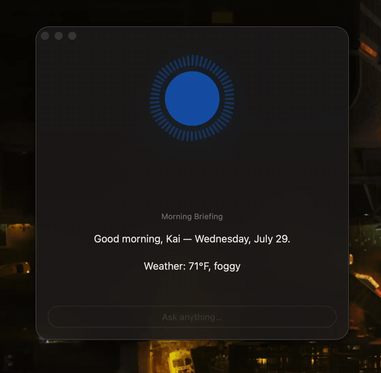

# Desktop Helper

A local, private macOS assistant powered by a language model we fine-tuned ourselves. It lives in your menu bar, answers in natural language, and calls real system tools — calendar, reminders, notes, weather, news, stocks, Spotify, screen reading, file search, and an app launcher — fetching live data at query time. Everything runs on your Mac; nothing is sent to the cloud.



*Ask by voice or text; the ring moves with your voice, and answers come from live system data.*

## How It Works

The model handles language (understanding your question, forming a reply). Live data is fetched at query time via tools the model learned to call during fine-tuning: it emits a `[CALL: tool]` token, the app runs the real tool and injects `[RESULT]…[/RESULT]`, and the model continues from real data.

```
You:    "What's on my calendar today?"
Model:  [CALL: calendar]
App:    → reads EventKit → "Standup at 9am, Lunch at 12pm"
Model:  "You've got standup at 9am and lunch at noon."
```

## Features

- **Conversational chat** — natural Q&A from a menu-bar reply panel (a Textual TUI is also available)
- **Calendar** — reads today's events via macOS EventKit
- **Reminders** — read your to-dos, and create new ones ("remind me to…")
- **Notes** — jot and read quick notes
- **Screen reading** — screenshots the screen, OCRs it on-device (Apple Vision), and describes what's on it
- **File finder** — locate your files by name via Spotlight
- **Weather · News · Stocks** — live conditions, headlines, and quotes
- **App launcher** — open apps from a configured allowlist by name
- **Spotify control** — play, pause, skip, volume, current track
- **Startup briefing** — weather, news, and calendar summary on launch
- **Voice input** — hold a hotkey to talk; transcribed locally with faster-whisper
- **Persistent memory** — conversation history via ChromaDB
- **Global hotkey & menu bar** — summon it from anywhere; ships as a self-contained `.app`

## The Model

The architecture is implemented from scratch in our own PyTorch — Llama-style: RoPE, RMSNorm, SwiGLU. The pretrained weights come from **SmolLM2-1.7B-Instruct** (Apache 2.0), transplanted into that architecture (and verified logit-equivalent to the reference), then **fine-tuned** on synthetic tool-use data so the model learns the `[CALL: tool]` routing while keeping its conversational ability.

| Property | Value |
|---|---|
| Architecture | Decoder-only transformer, Llama-style (RoPE, RMSNorm, SwiGLU) |
| Parameters | ~1.7B |
| Base weights | SmolLM2-1.7B-Instruct (transplanted, then fine-tuned) |
| Tool calling | Special tokens (`[CALL: <tool>]` / `[RESULT]…[/RESULT]`) |
| Training | Google Colab GPU (fine-tune + an embeddings-only warm start) |
| Inference | Apple Silicon (MPS) with a per-turn KV cache |

Earlier eras — an OPT-350M version, and before that an abandoned train-from-scratch attempt — are preserved on the `opt-350m` branch and chronicled in `docs/TIMELINE.md`.

### Measured results

| | |
|---|---|
| **Tool-routing accuracy** | **63% → 83%** — retrained on synthetic data with hard-negative sampling (`model/eval_routing.py`, 30 held-out cases, bare model with no keyword routers) |
| **Inference throughput** | **3.2 → 13.1 tok/s** on Apple Silicon (MPS) — a **4.1×** gain from a per-turn KV cache, byte-identical output |
| **Tool integrations** | 10, each on a real backend — no mocks |
| **Test suite** | 179 tests, including a logit-equivalence check that catches transplant bugs locally in seconds rather than after a multi-hour training run |

Routing is measured on the *bare* model — no pre-router, no keyword fallbacks — so the number reflects what the weights learned rather than what the app's safety nets cover.

## Stack

| Purpose | Library |
|---|---|
| Model | PyTorch |
| Tokenizer | HuggingFace Transformers / Tokenizers |
| Menu-bar app | rumps + AppKit (pyobjc) |
| Global hotkey | Carbon `RegisterEventHotKey` (via ctypes — no Accessibility needed) |
| Screen OCR | Apple Vision (pyobjc) |
| Voice input | faster-whisper |
| Memory | ChromaDB |
| Calendar / Reminders | pyobjc EventKit |
| Stocks | yfinance |
| Packaging | PyInstaller (self-contained `.app`) |
| TUI (optional) | Textual |

## Setup

> **Not a clone-and-run project.** It needs an Apple Silicon Mac, a fine-tuned
> checkpoint (~3.2 GB, gitignored — trained via `notebooks/train_colab.ipynb`),
> and macOS permission grants for calendar, mic, and screen recording. The code
> is here to be read; the app is built for one machine.

```bash
cp config.example.json config.json
# edit config.json — your name, allowed apps, location, feature toggles
uv sync
uv run python -m src.menubar     # menu-bar app (primary)
# uv run python -m src.main      # optional Textual TUI
```

The model checkpoint (gitignored) goes in `model/checkpoints/`. To build and install the standalone app:

```bash
uv run python scripts/freeze_app.py --install    # builds + installs Desktop Helper.app
```

When frozen, config and the checkpoint live in `~/Library/Application Support/Desktop Helper/`.

## Project Structure

```
src/
  assistant/            # model inference + tool dispatch (engine, dispatcher, tools)
  menubar/              # menu-bar app, reply panel, global hotkey
  calendar_integration/ reminders/ notes/   # EventKit calendar/reminders + notes
  eventkit/             # shared EKEventStore
  screen_capture/       # screenshot + Vision OCR
  file_finder/          # Spotlight search
  weather/ news/ stocks/ spotify/           # live-data tools
  briefing/             # startup summary
  voice/                # push-to-talk transcription
  memory/               # ChromaDB history
  ui/                   # Textual TUI (optional)
  paths.py  applog.py   # frozen-app paths + logging
  config/
model/                  # from-scratch transformer, tokenizer, training, checkpoints
scripts/                # freeze_app.py (build the .app), make_signing_cert.sh
docs/TIMELINE.md        # era-by-era history and measured results
```
